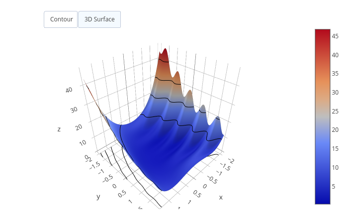

<script src="https://polyfill.io/v3/polyfill.min.js?features=es6"></script>
<script id="MathJax-script" async
        src="https://cdn.jsdelivr.net/npm/mathjax@3/es5/tex-mml-chtml.js">
</script>

# Assignment 1

## Introduction

This file contains instructions on how I proceeded to resolve the exercices of the assignments.

## Implementing objective functions
This project implements several objective functions required for optimization problems. 
The functions include a 2D quadratic function, an ND quadratic function, and a non-convex function.
Each function is evaluated over a grid, and the results are exported as CSV files to be visualized.


## Project Setup

1. I downloaded `aopt-exercise0.zip` and extracted it into a chosen folder.
2. I followed the instructions provided in the exercise slides to compile the project. 
After successfully compiling, I used the `CsvExporter` tool to generate the output CSV files for further visualization.

### Quadratic function

#### Point 2D

The 2D quadratic function is defined as:

\[
f(x) = \frac{1}{2} (x_1^2 + \gamma x_2^2)
\]

- I implemented this function in the file `FunctionQuadratic2D.hh` within the project. 
- By default, the value of $\gamma$ is set to -1 in the code.
- This function calculates the quadratic value based on two variables, $x_1$ and $x_2$, and evaluates it over a defined grid.

#### Step-by-Step Explanation

1. **Implementation:**
   - I defined the 2D quadratic function in the `eval_f()` method of `FunctionQuadratic2D.hh`.
   - The function computes values of $f(x)$ using the formula above for different grid points.

2. **Exporting CSV for 2D Quadratic Function:**
   - I exported the function evaluation results to a CSV file by running the following command (please, change the path to your desired location):
   
     ```bash
     ./CsvExporter /home/gobi/Documents/MyMaster/HS2024/Applied\ Optimiz/assignements/aopt-exercise0/aopt-exercise0/build/Build/bin/output.csv 1 -5 -5 5 5 10 10
     ```
   
     In this command:
     - The output file is stored in the specified directory (`output.csv`).
     - The arguments `1 -5 -5 5 5 10 10` define the grid range and step size for each dimension:
       - `1` indicates the 2D quadratic function.
       - `-5 -5` sets the lower bound of the grid for $x_1$ and $x_2$.
       - `5 5` sets the upper bound of the grid for $x_1$ and $x_2$.
       - `10 10` sets the grid size to 10x10.


3. **Result:**
   - I successfully generated a CSV file (`output.csv`) containing the evaluation of the 2D quadratic function over the grid [-5, 5] for both $x_1$ and $x_2$.

#### Point ND

The ND quadratic function is defined as:

$[
f(x) = \frac{1}{2} x^T A x + b^T x + c
]$

- I implemented this function in the file `FunctionQuadraticND.hh`.
- In this function, $A$ is an $n \times n$ matrix, and $b$, $x$, and $c$ are vectors.

#### Step-by-Step Explanation

1. **Implementation:**
   - I implemented the ND quadratic function in the `eval_f()` method of `FunctionQuadraticND.hh`.
   - The function computes values for a multi-dimensional quadratic function using matrix operations.

### A non-convex function

The non-convex function is defined as:

\[
h(x, y) = (y - x^2)^2 + \cos^2(4y) \cdot (1 - x)^2 + x^2 + y^2
\]

$$
h(x, y) = (y - x^2)^2 + \cos^2(4y) \cdot (1 - x)^2 + x^2 + y^2
$$


- I implemented this function in the file `FunctionNonConvex2D.hh`.
- This function is more complex and exhibits non-convex behavior, meaning it has multiple local minima.

#### Step-by-Step Explanation

1. **Implementation:**
   - I defined the non-convex function in the `eval_f()` method of `FunctionNonConvex2D.hh`.
   - The function computes values of $h(x, y)$ for various points over a grid in the 2D space defined by $x$ and $y$.

2. **Exporting CSV for Non-Convex Function:**
   - I generated the CSV file for the non-convex function by using the following command:
   
     ```bash
     ./CsvExporter /home/func0.csv 0 -2 -2 2 2 100 100
     ```

     In this command:
     - The output file is stored as `func0.csv`.
     - The arguments `0 -2 -2 2 2 100 100` define the grid range and step size:
       - `0` indicates the non-convex function.
       - `-2 -2` sets the lower bound of the grid for $x$ and $y$.
       - `2 2` sets the upper bound of the grid for $x$ and $y$.
       - `100 100` sets the grid size to 100x100.

3. **Result:**
   - I successfully generated a CSV file (`func0.csv`) containing the evaluation of the non-convex function over the grid [-2, 2] for both $x$ and $y$.




## Grid Search

### Grid Search 2D

I have modified the grid_search_2d function in the GridSearch.hh file and my solution lies between lines 31 and 67. It performs a double loop that will iterate over all the defined points in the grid between the lower and the upper bound.

After compilation, I ran the following command to test my implementation:

```bash
$ ./Build/bin/GridSearch 1 -5 5 10
```

Which gives me a minimal value of -12.5 at the point x = (0, 5).

### Grid Search 3D

I have modified the grid_search_nd function in the GridSearch.hh file and my solution lies between lines 80 and 104. I also implemented a helper function that allows us to recursively iterate over the n dimension of the N-dimensional grid and compute f(x) between the lower and the upper bound.

After compilation, I ran the following command to test my implementation:

```bash
$ ./Build/bin/GridSearch 2 -2 2 4 3
```

Which gives me a minimal value of -12.0438 for x = (0, 0, -2).

The implementation is very inefficient and time consuming, since running the following example:

```bash
$ ./Build/bin/GridSearch 2 -100 100 200 4
```

Took me 135.313 seconds to complete and find the optimal solution of -77146.5.
